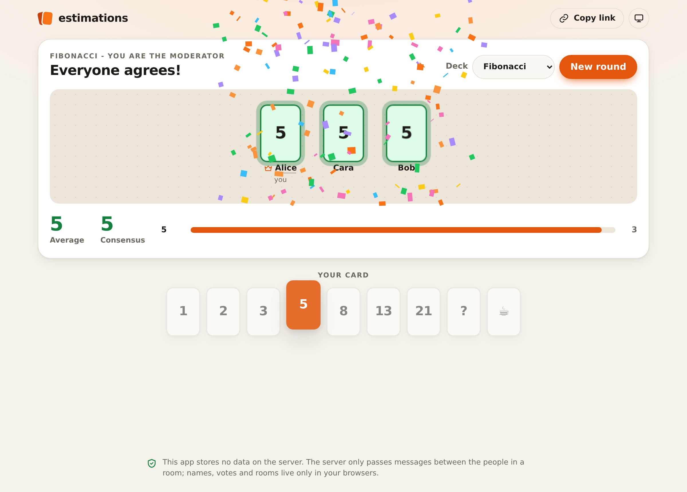
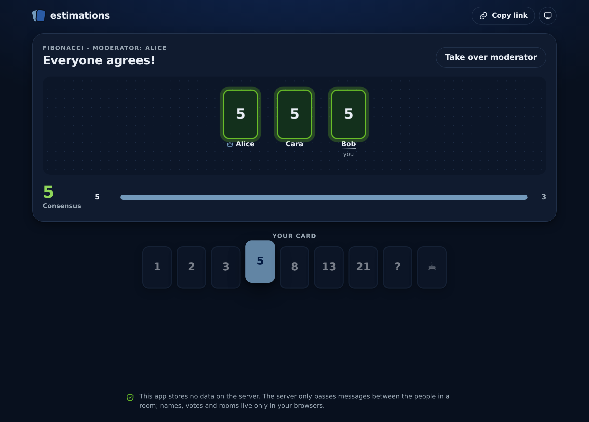
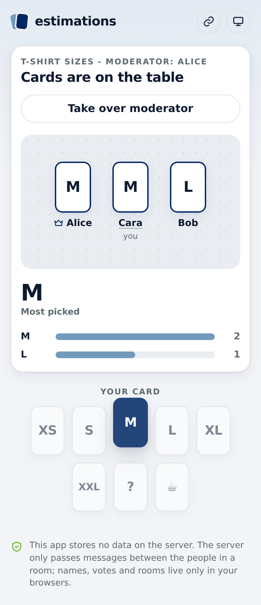

# estimations

Planning poker for teams that just want to estimate. Create a room, share the link, everyone picks a card, the
moderator reveals them all at once. No accounts, no database, nothing stored on the server.



## Features

- **Quick rooms.** One click creates `/rooms/<uuid>`; share the link and you are in.
- **Room names.** Optional: type one when you create the room, or the moderator names it later. Everyone who joins
  gets it with the rest of the room.
- **Saved rooms.** The start page lists the rooms this browser has been in, with their names and ids, to jump back
  in; the cross forgets one.
- **Rooms never expire.** There is nothing on the server to expire. Open the same link next week and carry on.
- **Hidden votes.** Before the reveal, a browser tells the others only *that* you voted, never the value. It is not
  hidden by CSS: the value does not leave your browser until the moderator reveals.
- **Moderator.** The first person in an empty room moderates: reveal the cards, start a new round, switch the deck.
  Anyone can ask to take the role over (for when the moderator walked away with the tab open): everyone sees a
  30-second bar, the moderator hears a chime and can keep the role, and if nobody answers it passes to the asker. If
  the moderator is already gone it passes at once, and if they leave for 30 seconds it passes on its own to whoever
  has been in the room the longest.
- **Two decks.** Fibonacci (`1 2 3 5 8 13 21 ? ☕`, the default) and T-shirt sizes (`XS S M L XL XXL ? ☕`).
- **Results.** Average (Fibonacci, snapped to the closest real card, ties going up: 5 and 13 average to 8, not 9),
  the most picked card and a breakdown; confetti when everyone agrees, and a "nice": put your own clip at
  `public/nice.mp3` (it is git-ignored, so it ends up in your image only); without one there is no sound.
- **Survives drops.** Reload the page or lose the connection and the people still in the room send you the current
  game. Your name and your vote for the current round are kept in your browser.
- **Sounds can be muted.** The speaker in the top bar turns the chime and the "nice" off for this browser; they are
  on by default and the choice is remembered.
- **Light and dark.** Follows the system by default; the toggle (system / light / dark) is remembered.
- **Works on phones.**

<p>
  
  
</p>

## How it works

The server is a relay of about 130 lines (`server.js`). It serves the page and, for each room, forwards every
WebSocket message to the other sockets in that room, stamping who sent it. It keeps only the list of open sockets,
in memory, and never reads, stores or logs what the messages say. Restarting it costs everyone a reconnect, not
their game.

The game state lives in the browsers (`public/app.js`):

- **The room** (round, revealed or not, deck, moderator, name) is shared. Whoever changes it bumps a version number and
  broadcasts it. Everyone keeps the highest version, ties going to the earlier change, so all browsers converge on
  the same room even when two changes cross.
- **Each person's record** (name, voted or not, and the value once revealed) is owned and published only by that
  person.
- **Joining:** a newcomer says `hello`; everyone answers with the room and the records they know. A reconnect is
  just another hello.
- **Reveal:** the moderator flips `revealed`, and every browser then publishes its own value. Someone who is
  offline at that moment shows as pending until they come back.

The trade-off of having no server state: a room is only as alive as the browsers in it. When the last person
leaves, the round is gone (the link still works and starts fresh). And since there is no server to referee,
anyone in a room could cheat with the browser console. It is a tool for teams that trust each other.

## Running it

With Docker:

```bash
docker compose -f docker-compose.example.yml up -d --build
# open http://localhost:8000
```

Or with Node 20+:

```bash
npm ci
node server.js
```

It listens on port 8000. `/healthz` answers `ok`. Put it behind any reverse proxy that passes WebSocket upgrades
(nginx, Caddy, Traefik, Cloudflare Tunnel); the page connects to `wss://` on the same host when served over HTTPS.

No configuration, no volumes, no environment variables.

## Limits

To keep a public instance well-behaved: 60 people per room, 16 KB per message, 200 messages per 10 seconds per
connection. Room ids must be UUIDs. Idle sockets are pinged every 25 seconds so proxies do not drop them.

## License

[The Unlicense](LICENSE): public domain. Do whatever you like with it.
